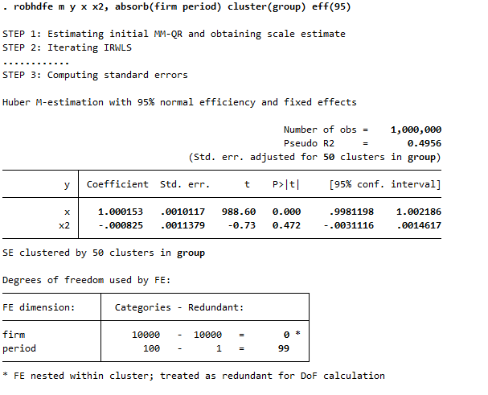

# robhdfe: Robust Huber M-estimation with high-dimensional fixed effects

This Stata package combines robust regression estimation (Huber M) with high-dimensional fixed effects and clustered standard errors. The program accompanies the Gassen & Veenman (2026) study on ["Estimation Precision and Robust Inference in Archival Research''](https://ssrn.com/abstract=6569958), forthcoming in the Journal of Accounting & Economics. The accompanying R package `ferols` can be found at https://github.com/joachim-gassen/ferols.

---

Installation:
```
net install robhdfe, replace from(https://raw.githubusercontent.com/dveenman/robhdfe/main/)
```

The packages requires `moremata`, `reghdfe`, and `hdfe` to be installed in Stata:
```
ssc inst moremata, replace
ssc inst hdfe, replace
ssc inst reghdfe, replace 
```

---

`robhdfe` can absorb multiple FE dimensions by leveraging the functionality of `reghdfe` or `areg` and the fact that the iterative reweighting in robust M-estimation relies on a sequence of weighted least squares estimations that can be combined with multidimensional FE. For the first-step quantile regression that is used to obtain the scale estimate, the package implements the MM-QR estimation from [Machado and Santos Silva (2019)](https://www.sciencedirect.com/science/article/pii/S0304407619300648) to combine quantile estimation with fixed effects, which [Rios-Avila, Siles, and Canavire-Bacarreza (2024)](https://papers.ssrn.com/sol3/papers.cfm?abstract_id=4944894) show is easily extended to the multidimensional fixed effects setting. When the second (time) dimension becomes sufficiently large (e.g., >50), the package is substantially faster than `robreg`. For a firm-time panel dataset (with no singleton observations), `robhdfe` provides the same estimates as `robreg m` with one FE dimension (firm) absorbed using the `ivar()` option and the other FE dimension (time) included as indicator variables.

Similar to `reghdfe` but unlike `robreg`, the package drops singleton observations by default. This implementation choice affects not only the degrees-of-freedom adjustment in the standard error calculation (see [Correia 2015](https://scorreia.com/research/singletons.pdf)), but in this case also ensures the scale parameter is correctly estimated with the MM-QR estimation. Singleton observations produce regression residuals that are equal to (or very close to) zero, causing the scale parameter to be understated when singleton observations are retained.

Standard errors can be adjusted for clustering by up to two dimensions. Nesting of the fixed effects within the clusters is not required.

The package comes with `python` and `julia` options, which can significantly speed up the estimation process for large datasets. The `python` option requires a Python installation and the [pyfixest](https://github.com/py-econometrics/pyfixest) package. The `julia` option requires a [Julia installation](https://github.com/JuliaLang/juliaup) and the following packages to be installed (and fully working) in Stata:
```
ssc inst julia, replace
ssc inst reghdfejl, replace 
```

---

Example syntax:
```
robhdfe m y x x2, absorb(firm) eff(95) 
robhdfe m y x x2, absorb(firm period) cluster(group) eff(95) 
robhdfe m y x x2, absorb(firm period) cluster(group) eff(70) 
robhdfe m y x x2, absorb(firm period) cluster(group period) eff(95) 
robhdfe m y x x2, absorb(firm period) cluster(group period) eff(95) keepsin
robhdfe m y x x2, absorb(firm period) cluster(group period) eff(95) python
robhdfe m y x x2, absorb(firm period) cluster(group period) eff(95) julia
```

---

The following example illustrates the standard output (it can be tested using the `test_robhdfe.do` file):




